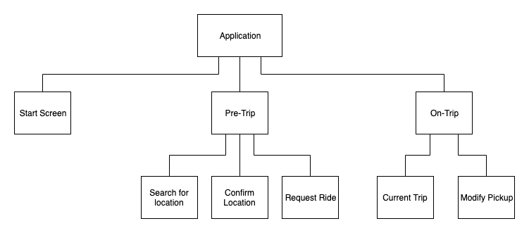
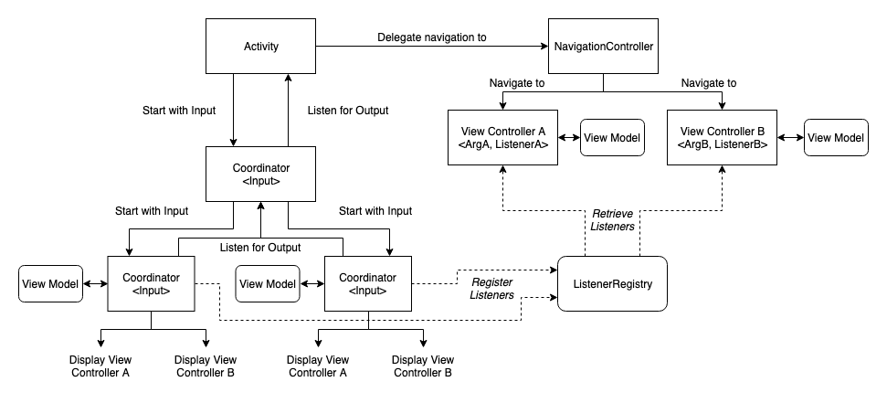

# App Architecture

## Overview
Our app architecture of the rider and driver apps was intentionally created to allow flexibility and easy customization of the internal implementation. The complexity of the applications comes from the fact that ride-hail rider and driver apps are *workflows*, not simply point-and-click applications. 

At its core, the app is split up into composable state machine modules. These modules form a state tree with the leafs displaying an actual screen. As an example, here is a simplified version of how the rider app is visualized:

Transitions from screens are essentially transitions from a leaf to another leaf.

## Class Diagram
To put this into a more concrete implementation, this diagram details how the app is actually broken up into different classes.

Let's go through this class by class:
#### Coordinator\<Input\>

A Coordinator is responsible for app navigation. It can choose to delegate to a child coordinator or to directly display a Fragment. This matches the implementation of the existing Coordinator class in iOS with more formality.

Formally, a coordinator takes an input and produces an output when finished. In this manner, any Coordinator that takes in the same input and produces the same output can be reused or replaced anywhere. This implementation is largely based on Square’s [Workflows](https://github.com/square/workflow).

Coordinators currently use a View Model to handle the state machine implementation, while the platform and navigation-specific code is handled by the coordinator itself.

#### ViewController\<Arguments, Listener\>
A View Controller (VC) binds a view to a View Model but in this context is not responsible for navigation. Formally, a VC takes input arguments and a listener to call when certain UI events are triggered. Again, any VC that takes in the same input and calls the same listener can be replaced.

In Android, these ViewControllers are implemented by Fragments in order to leverage native frameworks.

#### ViewModel
View Models are responsible for contacting backend services and mapping backend models to displayable models. These models are passed to the view controller for display using RxJava/RxSwift. View Models are currently used to capture all the logic for both Coordinators and View Controllers.

#### NavigationController
The navigation controller is responsible for displaying a view controller on the screen. On Android, it can be implemented by an Activity or parent fragment.

#### ListenerRegistry
The ListenerRegistry enables Fragments to be used. Fragments cannot take in functions as parameters so they cannot directly be constructed with a listener.

Coordinators can register themselves as callbacks with a certain identifier at app launch. Fragments are passed this identifier and can access the callbacks when the fragment is displayed.

#### Interactor (not shown)
Interactors are responsible for transforming API calls into RxJava observables. For example, the rideOS services are mapped to Interactors to bind our gRPC calls to observable models.

## Dependency Injection
Since the app architecture can be many layers deep, we use a simplified form of dependency injection to customize various dependencies in the app like interactors and maps. By switching out different interactors, we can change the backend that our applications use.

The rider and driver apps each expose a `DependencyRegistry`. This registry is how the application implementations register interactor and map dependencies. For an example, take a look at the [RiderDependencyRegistry](../rider_app/src/main/java/ai/rideos/android/rider_app/dependency/RiderDependencyRegistry.java).

The dependencies are registered at app launch in the Application class. For example, see the [ExampleRiderApplication](../example_rider_app/src/main/java/ai/rideos/android/example_rider_app/ExampleRiderApplication.java) class which registers Google maps as the map provider and the default set of interactors. This registration is necessary before starting any applications using the rider or driver libraries.

